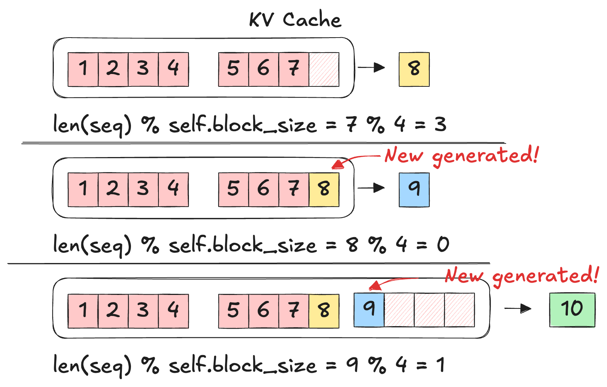

本文基于 [Nano-vLLM](https://github.com/GeeeekExplorer/nano-vllm) 源码实现，围绕 KV Cache Block 的**分配、复用与释放机制**，系统性拆解一个最小但完整的 BlockManager 设计。

> 参考代码实现：[block_manager.py](https://github.com/GeeeekExplorer/nano-vllm/blob/main/nanovllm/engine/block_manager.py)

## KV Cache Block 基本单位

一个 KV Cache Block 由以下几个属性来标识：

```python
class Block:  
	def __init__(self, block_id):  
		self.block_id = block_id  
		self.ref_count = 0  
		self.hash = -1  
		self.token_ids = []
```

Block 的 `hash` 值有以下两种情况：
1. 一个 KV Cache Block 只有在 `token_ids` 被完全填满时才会参与 prefix cache，此时其 `hash` 不是仅基于当前 block 的 token 计算，而是将**前一个 block 的 hash 与当前 block 的 `token_ids` 一起计算**（类似链式 hash），从而保证 hash 唯一对应完整的 prefix 路径
2. 而当 block 未填满或为空时，其 `hash` 视为无效（通常设为 -1 或不参与计算），不会参与 cache 匹配

Block 的 `hash` 值计算可以参考 [vLLM v1 Prefix Cache 实现](../llm-infra/Prefix%20Cache：前缀%20KV%20Cache%20缓存.md#vLLM%20v1%20Prefix%20Cache%20实现) 中的演示。

**Block 可能的状态**：

|**态**|**hash**|**token_ids**|**ref_count**|
|---|---|---|---|
|空闲（free）|-1|[]|0|
|填充中（partial）|-1|非空|≥1|
|可缓存（full）|有效hash|满|≥1|

Block 有两个 API：
- `update(hash: int, token_ids: list[int])`：拼接输入的 `token_ids` 并且更新 hash 值（可能是 -1 也有可能是实际意义的值）
- `reset()`：当 Block 被释放的时候被调用，此时清空引用记录、重制 hash 值并且清空 `token_ids` 列表

```python
class Block:
	def update(self, hash: int, token_ids: list[int]):
		self.hash = hash
		self.token_ids = token_ids
	
	def reset(self):
		self.ref_count = 1 # !!! <- 为什么是 1 将在后面解释
		self.hash = -1
		self.token_ids = []
```

## KV Cache Block Manager 实现


![[Attachments/BlockManager.png]]

在 [Nano vLLM 解读（3）：解析 Scheduler](Nano%20vLLM%20解读（3）：解析%20Scheduler.md) 中我们分析了 BlockManager 在 scheduling 过程中需要发挥的作用。具体而言：
- 在 Prefill 阶段
	- 需要判断是否可以分配新的 KV Cache Block 给请求 `can_allocate(seq)`
	- 实际分配新的 KV Cache Block 的操作 `allocate(seq)`
- 在 Decode 阶段（此时当前 step 推理还未发生）
	- 判断当前请求在生成一个新 token 后，若需要开启新的 block，是否还有足够的空闲 block：`can_append(seq)`
	- 在必要时（即新的 token 落到一个新 block 开头）追加新的 KV Cache block；或者在最后一个 block 被填满时，更新其 hash 和缓存索引：`may_append(seq)`
- 在完成请求或者被抢占时，释放掉请求的 KV Cache Block 块：`deallocate(seq)`

回顾一下在 [Nano vLLM 解读（1）：解析 Sequence](Nano%20vLLM%20解读（1）：解析%20Sequence.md) 中我们所介绍的 Sequence 对象中与 KV Cache Block 管理相关的参数：
- `block_table` 存储 Sequence 中实际上所拥有的 KV Cache Block 序号
- `num_blocks` 基于当前 token 数量推导出来的“应当占用的 block 数量”
	- **`num_blocks == len(block_table)` 的思考是错误的。**`num_blocks` 表示是这些 token **理论上占几个 block**，而 `block_table` 是系统是否已经给它**真的分配好了对应 block**
- `num_cached_tokens` 表示已经做完 prefill 并且存入 `block_table`（即已经写入 KV Cache）的 token 数量，用于 prefill 阶段
- `last_block_num_tokens` 表示 Sequence 的 `block_table[-1]` 所存储的 token 数量，用于检查 decode 阶段新产生的 token_id 是否需要分配新的 KV Cache Block

###  Prefill 阶段的函数实现

`can_allocate(seq)` 比较现有的空闲 KV Cache Block 和基于当前 token 数量推导出来的“应当占用的 block 数量”。

`allocate(seq)` 只有在 Prefill 阶段，即 `seq.block_table` 为空的时候才会被调用
- 这意味着即使 Scheduler 决定要对这个请求做 chunked prefill，也只有在 BlockManager 判断由足够空闲的 KV Cache Block 能容纳这个请求所有的 KV Cache Block 时才会进行。
- `cache_miss` 用于判断是否可以复用 prefix KV Cache，

步骤：
1. 按顺序遍历 `seq` 需要的每个 KV Cache Block。只有当当前 block 被填满时，才计算它基于 prefix 的 hash，并到 `hash_to_block_id` 中查找是否存在对应缓存 block。
2. 没有命中（意味着 hash 不一致，或者 hash 一致但是 token_id 不一致）（同时考虑了 Block 没满的情况），则需要分配新的 KV Cache Block，新的 block 从 `free_block_ids` 队首取出，并同步更新 `free_block_ids` 和 `used_block_ids`。
3. 如果命中缓存，则说明当前 block 可以复用：若 block 当前被使用，则更新 `ref_count`；若未被使用，则将其重新分配出来
4. 对于满块（`h != -1`），无论是新分配还是复用，都要
	1. 用当前 `token_ids` 更新 block 的内容，
	2. 维护 `hash_to_block_id[h] = block_id`
5. 最后把 `block_id` 记录到 `seq.block_table` 中。`

```python
class BlockManager:
    def can_allocate(self, seq: Sequence) -> bool:
        return len(self.free_block_ids) >= seq.num_blocks
        
    def _allocate_block(self, block_id: int) -> Block:
        block = self.blocks[block_id]
        assert block.ref_count == 0
        block.reset()
        self.free_block_ids.remove(block_id)
        self.used_block_ids.add(block_id)
        return block
        
    def allocate(self, seq: Sequence):
        assert not seq.block_table
        h = -1
        cache_miss = False
        
        for i in range(seq.num_blocks):
        
	        # (1)
            token_ids = seq.block(i)
            h = self.compute_hash(token_ids, h) if len(token_ids) == self.block_size else -1
            block_id = self.hash_to_block_id.get(h, -1) # 匹配
            
            # (2)
            if block_id == -1 or self.blocks[block_id].token_ids != token_ids:
                cache_miss = True
            if cache_miss:
                block_id = self.free_block_ids[0]
                block = self._allocate_block(block_id)
                
            # (3)
            else:
                seq.num_cached_tokens += self.block_size
                if block_id in self.used_block_ids:
                    block = self.blocks[block_id]
                    block.ref_count += 1
                else:
                    block = self._allocate_block(block_id)
                    
            # (4)
            if h != -1:
                block.update(h, token_ids)
                self.hash_to_block_id[h] = block_id
                
            # (5)
            seq.block_table.append(block_id)
```

### Decode 阶段的函数实现

`can_append(seq)` 用于判断若 `seq` 再追加一个 token，是否需要新 block；若需要，当前 free_block_ids 是否至少有一个空闲块。

关于 `can_append(seq)` 为什么是判断 `len(seq) % self.block_size == 1`  的解释：主要在于 sequence 最后一个 token 的 KV Cache 是在**下一轮**才被计算出来的，本质原因在于 decode 阶段 token 和 KV 存在一轮延迟。下图演示了这个过程：


`may_append(seq)` 具体执行这个操作。具体而言，有两种情况需要注意：
- `len(seq) % self.block_size == 1` 即上图最后一行，需要分配一个新块
- `len(seq) % self.block_size == 0` 即上图第二行，上一轮 decode 或者 prefill 完之后最后一个 KV Cache Block 满块了，此时需要计算其 hash 并且将其记录在 `hash_to_block_id` dict 中。
- 剩余情况，即块未满且不需要分配新块时，无需进行操作

```python
class BlockManager:
    def can_append(self, seq: Sequence) -> bool:
        return len(self.free_block_ids) >= (len(seq) % self.block_size == 1)

    def may_append(self, seq: Sequence):
        block_table = seq.block_table
        last_block = self.blocks[block_table[-1]]
        
        # 目前已经满块了，下一次 decode 需要分配新的 KV Cache Block
        if len(seq) % self.block_size == 1:
            assert last_block.hash != -1
            block_id = self.free_block_ids[0] # 拿出空闲块队首
            self._allocate_block(block_id)
            block_table.append(block_id)
            
        # 目前没有满块，但是上一轮 P/D 完之后最后一个 block 满块了
        elif len(seq) % self.block_size == 0:
            assert last_block.hash == -1
            token_ids = seq.block(seq.num_blocks-1)
            prefix = self.blocks[block_table[-2]].hash if len(block_table) > 1 else -1
            h = self.compute_hash(token_ids, prefix)
            last_block.update(h, token_ids)
            self.hash_to_block_id[h] = last_block.block_id
        else:
            assert last_block.hash == -1
```

### Deallocate 操作

释放这个块下的所有 KV Cache Block.


```python
class BlockManager:
    def _deallocate_block(self, block_id: int) -> Block:
        assert self.blocks[block_id].ref_count == 0
        self.used_block_ids.remove(block_id)
        self.free_block_ids.append(block_id)
        
    def deallocate(self, seq: Sequence):
        for block_id in reversed(seq.block_table):
            block = self.blocks[block_id]
            block.ref_count -= 1
            if block.ref_count == 0:
                self._deallocate_block(block_id) # <- 将其放入可用 block 队列
        seq.num_cached_tokens = 0
        seq.block_table.clear()
```