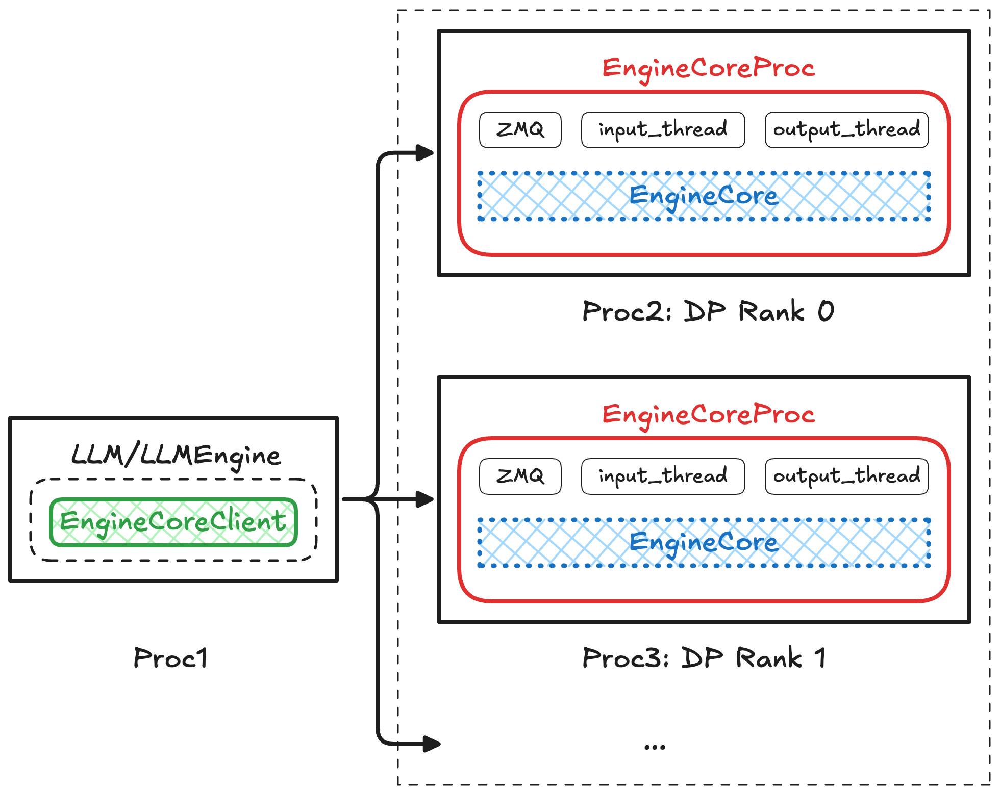
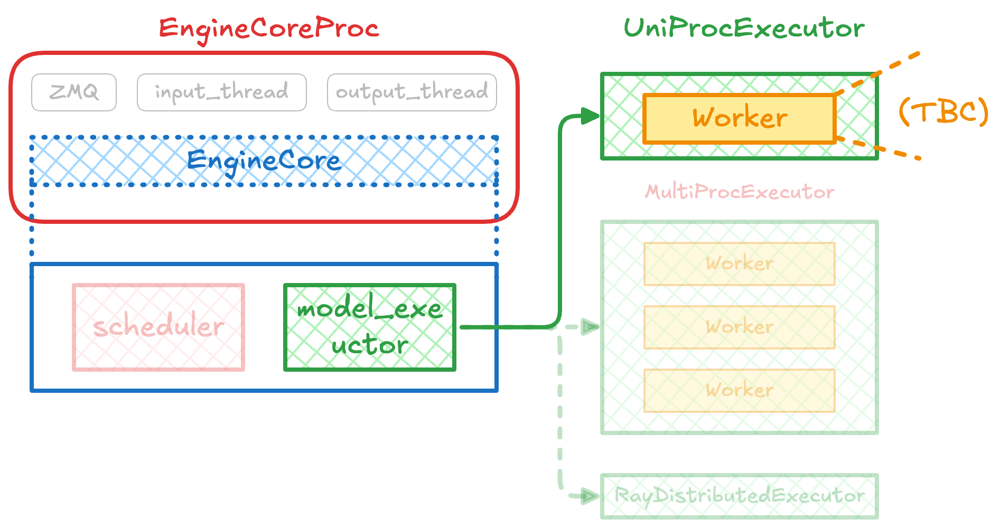
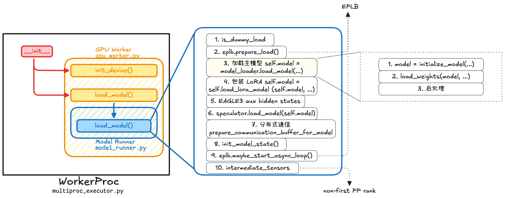
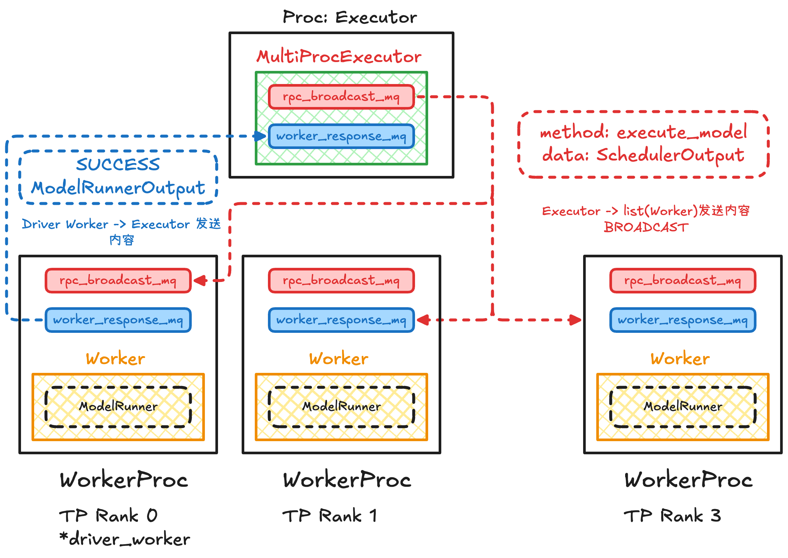

## 回顾

### `LLMEngine`, `EngineCoreProc` 和 `EngineCore`

在 [vLLM v1 离线推理流程源码 Debug](vLLM%20v1%20离线推理流程源码%20Debug.md) 中我们看到在 `LLMEngine` 中，`EngineCoreClient` 负责启动并连接一个独立的 `EngineCoreProc`。
- `EngineCoreProc` 运行在新的进程中，封装了 `EngineCore`[^2]，并在该进程内完成 `EngineCore` 的初始化。
- `EngineCoreProc` 额外负责进程间通信：通过 ZMQ 接收主进程发来的 `EngineCoreRequest`，放入本地 `input_queue`；再把内部执行得到的 `EngineCoreOutputs` 放入 `output_queue`，由输出线程通过 ZMQ 发回主进程[^1]。
- `EngineCore` 本身只关心推理引擎的核心业务逻辑：维护 scheduler、model executor、KV cache 等状态；在每轮 `step()` 中完成请求调度、模型执行和输出更新。



[^1]: (languisher) TODO: 可以讲一下是怎么实现的

[^2]: `EngineCoreProc` 虽然代码上看上去是继承了 `EngineCore`，实际上是 has-a 关系。

### `EngineCore`, `Exeuctor` 和 `Worker`


在 `EngineCore` 内部，核心组件主要是 `scheduler` 和 `model_executor`。
- `scheduler` 负责决定每个 step 实际调度哪些请求，以及每个请求本轮应执行多少 token。
- `model_executor` 负责把 `scheduler_output` 下发给底层执行单元，并真正执行模型 forward / sampling。

在**每个 step** 中，`EngineCore` 先调用 `scheduler.schedule()` 生成调度结果，然后调用 `model_executor.execute_model(...)` 执行模型。

`model_executor` 本质上是一个 `Executor` 实例。`Executor` 可以负责单设备执行，也可以作为分布式 executor 管理多个设备上的执行。

根据配置不同，vLLM 会选择不同的 `Executor`：
- `distributed_executor_backend == "uni"`：使用 `UniProcExecutor`[^3]
  - 通常对应单进程、单 worker 的简单场景。
  - executor 和 worker 在同一个进程中。
- `distributed_executor_backend == "mp"`：使用 `MultiprocExecutor`[^4]
  - 通常对应单机多进程场景。
  - 如果启用了 TP / DP，使得一个 executor 需要管理多个 worker，一般会走这个路径。
  - `Executor` 本身在 engine/core 进程中；每个 worker rank 都在独立的子进程中，使用进程间通信
- `distributed_executor_backend == "ray"`：使用 `RayDistributedExecutor`[^5]
  - 通常用于 Ray 编排的多节点或分布式场景。`



---

## Executor, Worker 和 ModelRunner 的职责划分

在具体介绍这些组件之前，我觉得最好先用自顶而下讲述一下这三者之间的联系：
- **ModelRunner** 是不断实际执行模型 forward 的部件。它是实际的工作者，但它无脑，它不关心输入是哪些请求、为什么这轮 batch_size 是等于 64，它就先把自己的权重装到设备上，然后嘎嘎执行完事了。所以它需要有人告诉他，每轮 forward 是啥，别人告诉他一次他执行一次，然后返回输出。
- **Worker** 管理一个 ModelRunner。Worker 接收来自上一层这轮要输出的请求。可是这个输出不能直接转换成 ModelRunner 具体执行的输入（我们将会看到），所以 Worker 负责将上层调度器输出的本轮将要执行的输入转化成 ModelRunner 实际能执行的输入。Worker 还负责其他杂活：管理该 rank 上的设备、分布式通信、显存/KV cache 等。
- **Executor** 接受同一层部件 Scheduler 的输出，即这一轮要执行 forward 的请求，准备给 ModelRunner 派活。Executor 主要应用在并行方面：因为有 TP、PP 等手段，这一轮执行 forward 的请求可能要同时交给多个 ModelRunner（即 Worker）执行，以及在不同地方需要同步等。在开了并行的情况下，存在多个 Worker 所以需要 Executor 负责统筹规划，把任务发给所有 Worker 协调他们同步执行。

---
## Worker

Worker 基于不同推理平台有不同实现，本文聚焦于 GPU Worker[^6]，其他还有 CPU Worker[^7]，XPU Worker[^8] 等。

### Worker 在 Executor 内初始化

#### 单 Worker 场景

在单 worker 场景下 Executor 类型是 `UniProcExecutor`，`UniProcExecutor` 可以理解为 `Worker` 的薄封装器。

在 `UniProcExecutor._init_executor()` 函数内，Worker 直接是 `Executor` 的一个属性：`driver_worker`.

```python
self.driver_worker = WorkerWrapperBase(rpc_rank=0)
# kwargs = ...
self.driver_worker.init_worker(all_kwargs=[kwargs])
self.driver_worker.init_device() # <--- 在后面展开
self.driver_worker.load_model() # <--- 在后面展开
```

1. 首先创建一个 `WorkerWrapperBase`。
2. 随后调用 `init_worker()`，根据当前推理平台和配置实例化对应类型的 Worker；在 GPU 场景下，最终会创建 `gpu_worker.py` 中的 `Worker`。
3. 之后调用 `init_device()` 完成 CUDA Device、分布式通信环境等运行时资源的初始化，为后续模型加载和推理执行做好准备。

Worker 中最主要的属性，即其部件 ModelRunner，负责模型权重管理与实际的 forward 执行。每个 Worker 对应一个 ModelRunner，我们将会在后文展开这个将近万行的 `GPUModelRunner`.

##### `init_device()` 和 ModelRunner 创建

核心代码如下：

```python
# vllm/v1/worker/gpu_worker.py: class Worker(WorkerBase):

def init_device(self):
    # 1. 处理 CUDA / NCCL 环境
    os.environ.pop("NCCL_ASYNC_ERROR_HANDLING", None)

    # 2. 修正 local_rank，尤其是 DP + TP/PP 场景
    self.local_rank += dp_local_rank * tp_pp_world_size

    # 3. 绑定当前进程使用的 GPU
    self.device = torch.device(f"cuda:{self.local_rank}")
    torch.accelerator.set_device_index(self.device)

    # 4. 初始化分布式环境：启动 torch.distributed
    init_worker_distributed_environment(...)

    # 5. 清理垃圾并测量初始显存
    gc.collect()
    torch.accelerator.empty_cache()
    self.init_snapshot = MemorySnapshot(device=self.device)

    # 6. 创建 GPUModelRunner
    self.model_runner = GPUModelRunner(...)
```


Worker 中的 ModelRunner 部件在调用 `Worker.init_device()` 时创建。


##### `load_model()` 和实际模型加载

下图展示了 `self.driver_worker.load_model()` 的调用逻辑。如果在多进程 Worker 场景下（我们将会看到），这会变成 `WorkerProc.__init__()` 调用 Worker 的 `load_model()` 函数。

虽然调用方式不同，但这个函数内部执行的内容都可以以下图表示：



#### 多 Worker 场景

在多 worker 场景下，Executor 类型通常是 `MultiprocExecutor`。`MultiprocExecutor` 是一个多进程 Worker 管理器。此时 Worker 就不再是 Executor 的属性了，`MultiprocExecutor`负责启动多个 Worker 进程，并通过消息队列向这些 Worker 广播执行请求、收集执行结果。

在 `MultiprocExecutor._init_executor()` 中，核心流程大致是：

```python
# multiproc_executor.py: MultiprocExecutor._init_executor()

for local_rank in range(self.local_world_size):
    # 1. 计算当前 Worker 的 global rank
    global_rank = global_start_rank + local_rank

    # 2. 判断该 Worker 是否是 driver_worker
    #    在每个 TP group 中，tp_rank == 0 的 worker 是 driver_worker
    is_driver_worker = self._is_driver_worker(global_rank)

    # 3. 启动一个独立的 Worker 进程（在后面会有展开）
    unready_worker_handle = WorkerProc.make_worker_process(
        vllm_config=self.vllm_config,
        local_rank=local_rank,
        rank=global_rank,
        distributed_init_method=distributed_init_method,
        input_shm_handle=scheduler_output_handle,
        shared_worker_lock=shared_worker_lock,
        is_driver_worker=is_driver_worker,
    )

    unready_workers.append(unready_worker_handle)

# 4. 等待所有本地 Worker 初始化完成，并收集它们的 response_mq handle
self.workers = WorkerProc.wait_for_ready(unready_workers)
```

```python
# multiproc_executor.py: WorkerProc.make_worker_process()

@staticmethod
def make_worker_process(...):
    context = get_mp_context()

    # 1. ready_pipe: Worker -> Executor
    #    Worker 初始化完成后，用它通知父进程 READY
    ready_reader, ready_writer = context.Pipe(duplex=False)

    # 2. death_pipe: Executor -> Worker
    #    Worker 用它检测父进程是否退出
    death_reader, death_writer = context.Pipe(duplex=False)

    # 3. 准备传给子进程的参数
    process_kwargs = {
        "vllm_config": vllm_config,
        "local_rank": local_rank,
        "rank": rank,
        "distributed_init_method": distributed_init_method,
        "input_shm_handle": input_shm_handle,
        "ready_pipe": ready_writer,
        "death_pipe": death_reader,
        "shared_worker_lock": shared_worker_lock,
        "is_driver_worker": is_driver_worker,
    }

    # 4. 创建 Worker 进程，入口函数是 WorkerProc.worker_main（在后面会有展开）
    proc = context.Process(
        target=WorkerProc.worker_main,
        kwargs=process_kwargs,
        name=f"VllmWorker-{rank}",
        daemon=True,
    )

    # 5. 启动子进程
    proc.start()

    # 6. 父进程关闭自己不需要的 pipe 端
    ready_writer.close()
    death_reader.close()

    # 7. 返回一个“尚未 ready”的 Worker handle
    return UnreadyWorkerProcHandle(
        proc=proc,
        rank=rank,
        ready_pipe=ready_reader,
        death_writer=death_writer,
    )
```

```python
# multiproc_executor.py: WorkerProc.worker_main()

@staticmethod
def worker_main(*args, **kwargs):
    ready_writer = kwargs.pop("ready_pipe")
    death_pipe = kwargs.pop("death_pipe")

    # 1. 在子进程中真正构造 WorkerProc
    worker = WorkerProc(*args, **kwargs)

    # 2. 启动 death_pipe 监听线程
    worker.monitor_death_pipe(death_pipe, shutdown_requested)

    # 3. Worker 初始化完成后，通过 ready_pipe 通知父进程
    ready_writer.send({
        "status": WorkerProc.READY_STR,
        "handle": worker.worker_response_mq.export_handle(),
        "peer_response_handles": worker.peer_response_handles,
    })

    # 4. 等待 MQ 就绪
    worker.rpc_broadcast_mq.wait_until_ready()
    worker.worker_response_mq.wait_until_ready()

    # 5. 进入 Worker 主循环，等待 Executor 发 RPC
    worker.worker_busy_loop()
```

##### 初始化流程

`driver_worker` 是一个 Worker Group 的代表。它负责与 Executor 对接，并承担一些只需要单个 rank 执行的控制逻辑（通常是 TP Rank 0）。

1. 首先根据 `local_world_size` 知道每个进程对应的 `local_rank`
2. 调用 `WorkerProc.make_worker_process(...)` 启动多个本地 Worker 进程；每个进程对应一个 `local_rank` 和一个全局 `rank`。
3. 每个 Worker 进程的入口是 `WorkerProc.worker_main()`，进程内部会构造一个 `WorkerProc`。
4. 在 `WorkerProc.__init__()` 中，会创建 `WorkerWrapperBase`，并通过 `init_worker()` 实例化真正的平台相关 Worker；在 GPU 场景下，最终创建的是 GPU Worker。
5. 随后每个 Worker 进程分别调用 `init_device()` 和 `load_model()`，完成设备初始化、分布式通信初始化以及模型加载。
6. 所有 Worker 初始化完成后，会通过 ready pipe 向 `MultiprocExecutor` 发送 `READY` 信号；`MultiprocExecutor` 调用 `WorkerProc.wait_for_ready()` 等待所有 Worker 就绪。

##### Executor 和 Worker 之间的通信实现




初始化完成后，Executor 和 Worker 之间的通信：
- `MultiprocExecutor` 通过 `rpc_broadcast_mq` 向所有 Worker 广播 RPC 请求（例如 `execute_model()`）。
- **每个 Worker 在自己的 `worker_busy_loop()` 中接收请求并执行对应方法。**[^9]
- 执行完成后，Worker 会通过 `worker_response_mq` 将执行结果返回给 Executor。

需要注意的是，请求通常会广播给所有 Worker 执行，但返回结果时不一定所有 Worker 都会回复；对于推理请求，通常只有指定的 `output_rank`（例如最后一个 Pipeline Stage 的 TP Rank 0）负责向 Executor 返回 `ModelRunnerOutput`，其余 Worker 仅参与计算而不返回结果。


## ModelRunner v2

> 参考代码：`vllm/v1/worker/gpu/model_runner.py`

有了 Worker 帮助它做杂活，接下来看 ModelRunner 是怎么具体执行推理的。

### 核心属性

|**属性**|**作用**|
|---|---|
|self.model|真正执行 forward 的模型|
|self.model_state|模型运行期状态与输入准备逻辑|
|self.req_states|每个请求的逻辑状态|
|self.input_buffers|GPU 上的输入缓冲区|
|self.kv_caches|真正的 KV cache tensor|
|self.block_tables|请求到 KV block 的映射|
|self.attn_backends|attention 执行后端|
|self.sampler|logits 到 token 的采样器|
|self.cudagraph_manager|CUDA Graph capture/replay 管理|
|self.execute_model_state|forward 和 sample 之间的临时状态|

#### 核心函数：`load_model()` 加载模型

具体流程我们已经在 [`load_model()` 和实际模型加载](#`load_model()`%20和实际模型加载) 看到，这里再重复放一下 `load_model()` 的实际执行逻辑：


[^3]: `vllm/v1/executor/uniproc_executor.py`

[^4]: `vllm/v1/executor/multiproc_executor.py`

[^5]: `vllm/v1/executor/ray_executor.py`

[^6]: `vllm/v1/worker/gpu_worker.py`

[^7]: `vllm/v1/worker/cpu_worker.py`

[^8]: `vllm/v1/worker/xpu_worker.py`

[^9]: 即 Remote Procedure Call (RPC)

## 参考资料

- [Inside vLLM: Anatomy of a High-Throughput LLM Inference System](https://www.aleksagordic.com/blog/vllm)
- [vLLM V1 ModelRunner详解](https://zhuanlan.zhihu.com/p/1913621030922098549)