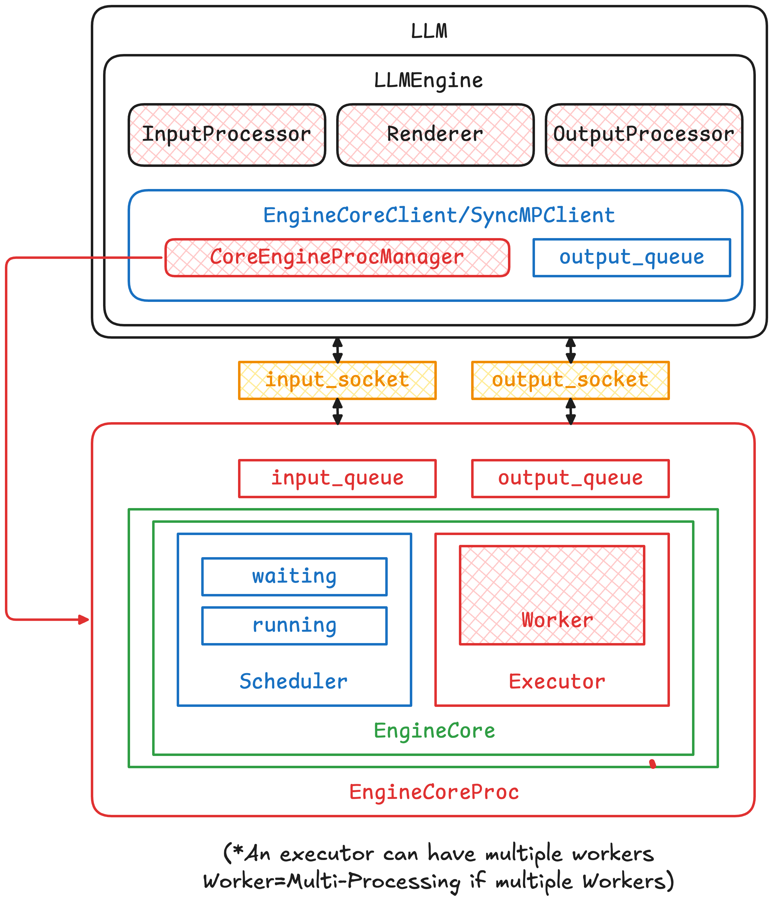
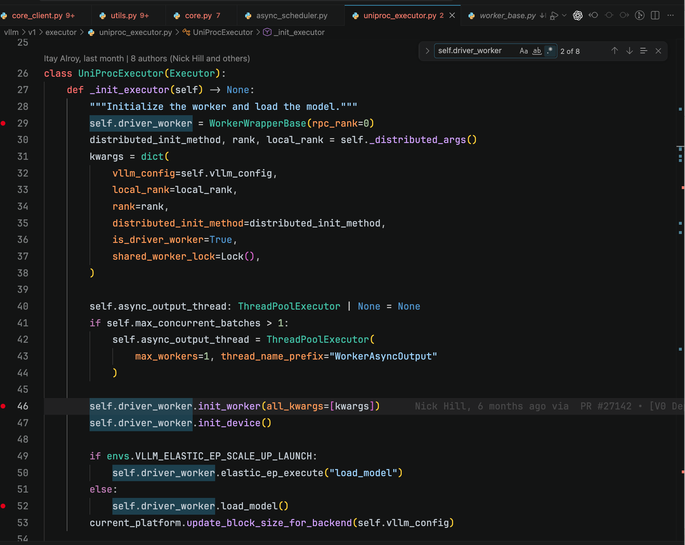
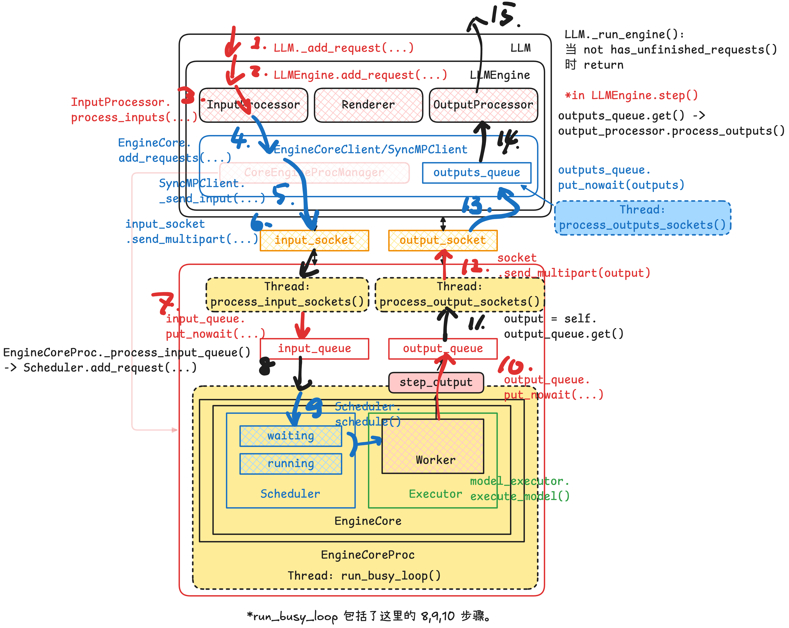

我们以 [`examples/basic/offline_inference/basic.py`](https://github.com/Languisher/vllm-260519/blob/main/examples/basic/offline_inference/basic.py) 为例进行调试，可以看到在用户准备好 `prompts: list[str]` 与 `sampling_params: SamplingParams` 之后，整个离线推理流程表面上只分为两个步骤：
1. 初始化 `LLM`
2. 调用 `llm.generate(...)` 获得输出

看起来非常简单，但实际上这是整一套复杂推理系统的冰山一角。真正的工作——包括进程启动、EngineCore 初始化、模型加载、KV Cache 管理、调度器构建、通信系统建立，以及 GPU execution runtime 的准备——都藏在复杂的多进程多线程系统之后。

在本篇文章里面我们从最简单的离线推理例子 walk through 整套 vLLM 系统的推理流程。


> 本文参考 vLLM 版本：[vllm-260519](https://github.com/Languisher/vllm-260519)

## vLLM v1 离线推理核心组件示意图



在离线推理阶段，可以用上图来表示所有组件之间的关系。需要注意的是 LLM 框和 EngineCoreProc 分别画在不同的框里，代表两个组件分别在不同的进程之间运行。正如下文将会看到，两个进程需要进行通信，通过 [Python ZMQ：消息传递库](../communication/Python%20ZMQ：消息传递库.md) 实现，以及通过 `input_socket` 和 `output_socket` 进行通信。图中 `CoreEngineProcManager` 指向 `EngineCoreProc` 的箭头表示 `CoreEngineProcManager` 负责维护这个进程的生命周期、上下文管理等。

## 初始化阶段

### `LLM`

1. 推理系统的初始化全部藏在 `LLM(...)` 之后。
2. 进入 `LLM.__init__(...)` 初始化函数
3. 在参数封装成 `EngineArgs` 之后，`LLM` 负责初始化 `LLMEngine`

本小节的剩余内容都用来解析第一行是怎么运行的 ;((((

:::gallery


:::

### `LLM/LLMEngine`

1. `LLMEngine.from_engine_args(...)` 被调用之后会生成并初始化一个 `LLMEngine` 实例。这里 `executor_class`=`<class 'vllm.v1.executor.uniproc_executor.UniProcExecutor'>`
2. 进入 `LLMEngine.__init__(...)`
3. 这里可以看到 `LLMEngine` 有四个关键部件：
- `renderer`：负责把用户输入渲染成模型可接受的 prompt 形式，例如应用 `chat_template`、处理 tokenizer/detokenizer 相关逻辑等。这里暂不展开。
- `input_processor`：负责把外部传入的 `prompt + params` 转换成 `EngineCoreRequest`。也就是说，它把“用户视角的请求”整理成“调度与执行系统能理解的请求”。
- `output_processor`：负责把 `EngineCore` 返回的低层输出转换成最终的 `RequestOutput` / `PoolingRequestOutput`。它还维护请求状态，例如流式输出、停止条件、完成请求、需要 abort 的请求等。
- `engine_core`：重头戏。它接收 `EngineCoreRequest` 并返回 `EngineCoreOutput`。这里我们 step into `EngineCoreClient.make_client(...)` 看它怎么构造一个实际负责推理的 `engine`.

:::note
这里 `EngineCoreClient.make_client(...)` 会返回一个 `EngineCoreClient`。**在 multiprocess 模式下，`LLMEngine` 实际并不直接持有真正执行推理的 `EngineCore`，而是通过 `EngineCoreClient` 间接与 `EngineCoreProc` 交互。**
:::

:::gallery


:::

可以看到 `LLMEngine` 的 `engine_core` 变量事实上是个 Client 对象。

### ``LLM/LLMEngine/EngineCoreClient (SyncMPClient)``

1. `EngineCoreClient` 可以理解为 `LLMEngine` 与底层 `EngineCore` 之间的代理层。  它对上向 `LLMEngine` 暴露统一接口，对下则根据运行模式决定：
	- 单进程模式：直接调用本地 `EngineCore`
	- 多进程模式：spawn 一个 `EngineCoreProc` 子进程，并通过 ZMQ/IPC 与其通信
	- 在目前的配置下，`EngineCoreClient` 启动 `SyncMPClient`。
2. `SyncMPClient` 会首先进行 `MPClient` 的初始化
3. 这里可以关注一下在 `MPClient` 中初始化的注释。

:::gallery


:::

**【重点】下面两张图相当重要**.在 multiprocess 模式下，`MPClient` 首先创建两条 ZMQ 通信通道：
- `input_socket`：前端请求通道。它是一个 `ROUTER` socket，绑定在 `addresses.inputs[0]` 上，用来向后端 `EngineCoreProc` 发送 `EngineCoreRequest`、abort 请求和 utility call。
- `output_socket`：后端输出通道。它是一个 `PULL` socket，用来接收 `EngineCoreProc` 返回的 `EngineCoreOutputs`。

随后，`launch_core_engines(...)` 会启动真正的后端 `EngineCoreProc`。注意这里传递的不是 socket 本身，而是同一组 `addresses`。也就是说，前端和后端并不共享 `ZMQ Context` 或 socket object，而是各自在自己的进程中创建 socket，并通过相同的 address 建立连接。

【为什么 `input_socket` 用 `ROUTER`，而 `output_socket` 用 `PULL`？】因为两个方向的通信需求不同。
- 在请求发送方向，frontend 可能连接多个 `EngineCoreProc`，并且需要根据 `engine_identity` 指定请求发给哪个 engine。因此 `input_socket` 使用 `ROUTER`，让 frontend 具备定向路由和多 engine 调度能力。
- 而在输出返回方向，backend 不需要再做复杂路由；任意 `EngineCoreProc` 只要生成了 `EngineCoreOutputs`，直接通过 `PUSH` 推回 frontend 即可。frontend 只需要用 `PULL` 汇聚所有 engine 返回的输出。

:::gallery

:::

### `LLM/LLMEngine/EngineCoreClient/CoreEngineProcManager`

这里进入 `launch_core_engines(...)` 函数。
- 这个函数会创建一个 `CoreEngineProcManager` 对象，专门负责创建一个或多个（在多 DP/TP 等场景下）`EngineCoreProc` 实例、其运行环境配置以及生命周期管理，避免孤儿进程以及 `EngineCoreProc` 意外死亡等
- 这个函数不属于 `EngineCoreClient (SyncMPClient)`
- 生成的 `CoreEngineProcManager` 是返回给 `EngineCoreClient (SyncMPClient)` 持有（结合前文第二张图和后文可以看到）。

:::gallery


:::

### `EngineCoreProc`

1. 这里 `EngineCoreProc` 进程已经被创建出来，我们切换到 `EngineCoreProc` 进程查看运行情况。
2. 在读取配置后创建 `EngineCoreProc（...)` 对象

:::gallery


:::

分别创建 `self.input_queue` 和 `self.output_queue` 对象。
- 这两个对象是 `EngineCoreProc` 与从上层 `EngineCoreClient` 交互的重要接口，用于获取/写入数据
- 分别有独立线程 `process_{input/output}_sockets(...)` 处理（我们将会看到）

具体而言：
- `input_queue` 用于缓存从 ZMQ socket 接收到的请求，由后台线程 `process_input_sockets(...)` 持续接收、反序列化并写入队列，随后由 `run_busy_loop()` 主循环读取并处理。
- `output_queue` 用于缓存 `EngineCore` 产生的推理输出，由主循环写入，再由后台线程 `process_output_sockets(...)` 负责序列化并通过 ZMQ socket 发回 `EngineCoreClient`。

在 `EngineCoreProc` 的初始化中，触发 `EngineCore` 的初始化
- 如何理解这两个元件？EngineCoreProc = EngineCore + ZMQ/Process Wrapper

:::gallery


:::

### `EngineCoreProc/EngineCore/Executor`

先初始化 `Executor`[^1]. 

[^1]: 前文已经提过 `model_executor` 的类型是 `<class 'vllm.v1.executor.uniproc_executor.UniProcExecutor'>`

:::gallery


:::

### `EngineCoreProc/EngineCore/Executor/Worker`

再由 `Executor` 初始化 `Worker`，由 `Worker` 完成模型加载。[^2]

[^2]: `Executor` 和 `Worker` 的区别：这里 `Executor` 外层逻辑负责管理多个 worker 执行，更像是模型推理的 control plane，而其内部的 `worker` 是实际的执行元件，由 `Executor` 完成初始化。


:::note[EngineCore vs Worker]
这里其实已经可以看到，vLLM 系统里存在两层并行。

第一层是外层的 **EngineCore 并行**。每个 `EngineCore` 可以看作一个相对独立的推理副本，拥有自己的 scheduler、KV cache 管理器以及一组模型执行 worker。因此在 DP 场景下，不同 `EngineCore` 通常对应不同的 DP replica / DP rank：它们加载相同的模型副本，处理不同的请求流，这正好符合推理阶段 data parallelism 的 embarrassingly parallel 特性。

第二层是内层的 **Worker 并行**。`Worker` 是模型执行层的基本计算单元，通常对应一个 GPU/distributed rank，并参与 TP、PP、EP 等模型并行组。也就是说，TP/PP/EP 主要发生在一个 `EngineCore` 内部的 worker group 之间：这些 workers 共同完成一次模型 forward，而外层的多个 `EngineCore` 则负责复制这套执行能力来承接更多请求。

因此可以粗略理解为：
- `DP` 复制的是 `EngineCore + Worker group`；
- `TP/PP/EP` 切分的是单个 `EngineCore` 内部的 `Worker group`。
:::



### `EngineCoreProc/EngineCore/Scheduler`

完成 `Executor` 的初始化之后，还有控制面的 Scheduler 需要初始化。这里通过 debug 可以看到 Scheduler 的类型是 `<class 'vllm.v1.core.sched.async_scheduler.AsyncScheduler'>`

:::gallery


:::

### `EngineCoreProc` Threads

`EngineCoreProc (EngineCore)`:  最后，处理 `input_queue` 和处理 `output_queue` 分别由对应的 thread 处理 


以上完成全部初始化的步骤


## 推理阶段

接下来从 `LLM.generate(...)` 开始进入真正的推理流程。


总体而言，可以分成 15 个步骤：



以下所有的方法我都标注了类名（而不是 `self`）以方便读者查阅。

> 下面段落我让 GPT 帮我标注了一下对应 vLLM GitHub 仓库代码位置，感谢大模型🙏

### 请求提交

```
LLM.generate(...)
|--- LLM._run_completion(...)
     |--- LLM._add_completion_requests(...)
     |    |--- LLM._render_and_add_requests(...)
     |         |--- LLM._add_request(...)
     |              |--- LLMEngine.add_request(...)
     |                   |--- LLMEngine.input_processor.process_inputs(...)
     |                   |    |--- return EngineCoreRequest
     |                   |
     |                   |--- LLMEngine.output_processor.add_request(...)
     |                   |    |--- 在主进程登记 request 状态
     |                   |
     |                   |--- LLMEngine.engine_core.add_request(...)
     |                        |--- SyncMPClient.add_request(...)
     |                             |--- SyncMPClient._send_input(...)
     |                                  |--- SyncMPClient.input_socket.send_multipart(...)
```

1. 在 [`LLM.generate(...)`](https://github.com/Languisher/vllm-260519/blob/d247a931cc25e7253feccbd6260d48216ff5c081/vllm/entrypoints/llm.py#L425-L493) 时会调用 [`LLM._run_completion(...)`](https://github.com/Languisher/vllm-260519/blob/d247a931cc25e7253feccbd6260d48216ff5c081/vllm/entrypoints/llm.py#L1064-L1085)
   - 因此会调用 [`LLM._add_completion_requests(...)`](https://github.com/Languisher/vllm-260519/blob/d247a931cc25e7253feccbd6260d48216ff5c081/vllm/entrypoints/llm.py#L1017-L1062) 和 [`LLM._run_engine(...)`](https://github.com/Languisher/vllm-260519/blob/d247a931cc25e7253feccbd6260d48216ff5c081/vllm/entrypoints/llm.py#L1258-L1318)
   - 先看 [`LLM._add_completion_requests(...)`](https://github.com/Languisher/vllm-260519/blob/d247a931cc25e7253feccbd6260d48216ff5c081/vllm/entrypoints/llm.py#L1017-L1062)，会先调用 [`LLM._render_and_add_requests(...)`](https://github.com/Languisher/vllm-260519/blob/d247a931cc25e7253feccbd6260d48216ff5c081/vllm/entrypoints/llm.py#L1213-L1237)
   - 接着对每个请求调用 [`LLM._add_request(...)`](https://github.com/Languisher/vllm-260519/blob/d247a931cc25e7253feccbd6260d48216ff5c081/vllm/entrypoints/llm.py#L1239-L1256)

   这里可以把 `LLM.generate(...)` 理解成离线推理 API 的入口函数。它本身并不直接执行模型 forward，而是把整个流程拆成两部分：先把用户传入的 prompts、sampling params 等输入转成内部请求并提交给 engine；然后再启动 engine 循环，不断取回输出，直到所有请求完成。

2. [`LLM._add_request(...)`](https://github.com/Languisher/vllm-260519/blob/d247a931cc25e7253feccbd6260d48216ff5c081/vllm/entrypoints/llm.py#L1239-L1256) 时会调用 [`LLMEngine.add_request(...)`](https://github.com/Languisher/vllm-260519/blob/d247a931cc25e7253feccbd6260d48216ff5c081/vllm/v1/engine/llm_engine.py#L218-L294)

   这一层开始从 `LLM` API 层进入 `LLMEngine` 层。`LLM` 更像是用户侧的封装，而 `LLMEngine` 才是真正负责管理请求生命周期、输出处理器以及底层 `EngineCore` 通信的核心对象。

3. 在 [`LLMEngine.add_request(...)`](https://github.com/Languisher/vllm-260519/blob/d247a931cc25e7253feccbd6260d48216ff5c081/vllm/v1/engine/llm_engine.py#L218-L294) 中，执行 [`LLMEngine.input_processor.process_inputs(...)`](https://github.com/Languisher/vllm-260519/blob/d247a931cc25e7253feccbd6260d48216ff5c081/vllm/v1/engine/llm_engine.py#L245-L257)，返回一个 `EngineCoreRequest` 对象[^3]

   这一步的核心作用是把 API 层输入转换成 `EngineCore` 能理解的请求格式。也就是说，用户传入的 prompt、sampling params、LoRA request、priority 等信息，会在这里被整理成统一的 `EngineCoreRequest`，为后面跨进程传输和调度执行做准备。

4. 同样仍然是在 [`LLMEngine.add_request(...)`](https://github.com/Languisher/vllm-260519/blob/d247a931cc25e7253feccbd6260d48216ff5c081/vllm/v1/engine/llm_engine.py#L218-L294) 中，接着执行下面两行：
   - [`LLMEngine.output_processor.add_request(request, prompt_text, None, 0)`](https://github.com/Languisher/vllm-260519/blob/d247a931cc25e7253feccbd6260d48216ff5c081/vllm/v1/engine/llm_engine.py#L272-L275) 这一行是先登记这个 request 的状态，以使得完成推理之后能够根据 `request_id` 找到对应的 detokenizer、logprobs processor、输出模式等。
   - [`LLMEngine.engine_core.add_request(request)`](https://github.com/Languisher/vllm-260519/blob/d247a931cc25e7253feccbd6260d48216ff5c081/vllm/v1/engine/llm_engine.py#L276-L278) 也就是由 `EngineCoreClient` 去将这个请求发送给实际执行推理的 `EngineCoreProc`

   这里其实有一个非常重要的双登记动作：一方面，`output_processor` 要先知道这个请求的存在，否则后面模型算完返回 token 时，主进程不知道如何还原成用户需要的 `RequestOutput`；另一方面，`engine_core.add_request(...)` 会把请求真正送到底层执行引擎中。前者负责回来以后怎么处理，后者负责现在送去哪里执行。

5. 【准备跨进程】由于 `engine_core=SyncMPClient` 这会调用 [`SyncMPClient.add_request(...)`](https://github.com/Languisher/vllm-260519/blob/d247a931cc25e7253feccbd6260d48216ff5c081/vllm/v1/engine/core_client.py#L815-L818)，这会调用 [`SyncMPClient._send_input(...)`](https://github.com/Languisher/vllm-260519/blob/d247a931cc25e7253feccbd6260d48216ff5c081/vllm/v1/engine/core_client.py#L791-L806)

   到这里，请求开始离开主进程。`SyncMPClient` 是主进程侧持有的 `EngineCoreClient`，它的作用不是执行模型，而是把请求序列化并通过 ZMQ socket 发给后台的 `EngineCoreProc` 进程。

6. 调用 [`SyncMPClient.input_socket.send_multipart(...)`](https://github.com/Languisher/vllm-260519/blob/d247a931cc25e7253feccbd6260d48216ff5c081/vllm/v1/engine/core_client.py#L797-L804)，通过 `input_socket` 发送出去

   这里真正发生跨进程通信。请求会被编码成 multipart message，里面包含目标 EngineCore identity、请求类型以及序列化后的请求内容。对于主进程来说，到这一步它已经把任务“投递”出去了；真正的调度、KV Cache 管理、模型 forward 都发生在另一侧的 `EngineCoreProc` 中。

### 后端执行

```
EngineCoreProc.process_input_sockets(...)
|--- socket.recv_multipart(...)
|--- deserialize request
|--- EngineCoreProc.input_queue.put_nowait((request_type, request))

EngineCoreProc.run_busy_loop(...)
|--- EngineCoreProc._process_input_queue()
|    |--- EngineCoreProc._handle_client_request(...)
|         |--- EngineCoreProc.add_request(...)
|              |--- EngineCore.scheduler.add_request(...)
|
|--- EngineCoreProc._process_engine_step()
     |--- EngineCore.step()
          |--- Scheduler.schedule()
          |    |--- 生成本轮 SchedulerOutput
          |
          |--- model_executor.execute_model(...)
          |    |--- 执行本轮模型 forward
          |
          |--- 生成 EngineCoreOutputs
          |
		  |--- output_queue.put_nowait(outputs)
```

7. 现在我们进入了 [`EngineCoreProc`](https://github.com/Languisher/vllm-260519/blob/d247a931cc25e7253feccbd6260d48216ff5c081/vllm/v1/engine/core.py#L796-L909) 进程。`EngineCoreProc` 包含了三个线程：[`process_input_sockets()`](https://github.com/Languisher/vllm-260519/blob/d247a931cc25e7253feccbd6260d48216ff5c081/vllm/v1/engine/core.py#L1396-L1489), [`process_output_sockets()`](https://github.com/Languisher/vllm-260519/blob/d247a931cc25e7253feccbd6260d48216ff5c081/vllm/v1/engine/core.py#L1491-L1562) 和 [`run_busy_loop()`](https://github.com/Languisher/vllm-260519/blob/d247a931cc25e7253feccbd6260d48216ff5c081/vllm/v1/engine/core.py#L1174-L1179)。首先由 [`process_input_sockets()`](https://github.com/Languisher/vllm-260519/blob/d247a931cc25e7253feccbd6260d48216ff5c081/vllm/v1/engine/core.py#L1396-L1489) 读取来自 `input_sockets` 的数据写入 `input_queue`: [`EngineCoreProc.input_queue.put_nowait((request_type, request))`](https://github.com/Languisher/vllm-260519/blob/d247a931cc25e7253feccbd6260d48216ff5c081/vllm/v1/engine/core.py#L1487-L1489)[^4]

   `process_input_sockets()` 是一个专门负责 IO 的线程。它并不直接调度请求，而是把 socket 中收到的请求解码之后放入 `input_queue`。这样设计的好处是：ZMQ IO、反序列化、请求预处理和真正的调度执行可以解耦，避免模型执行主循环被 socket IO 细节阻塞。

8. 从第 8-10 步是进入 [`EngineCoreProc.run_busy_loop()`](https://github.com/Languisher/vllm-260519/blob/d247a931cc25e7253feccbd6260d48216ff5c081/vllm/v1/engine/core.py#L1174-L1179) 的循环：
   - 会先进行 [`EngineCoreProc._process_input_queue()`](https://github.com/Languisher/vllm-260519/blob/d247a931cc25e7253feccbd6260d48216ff5c081/vllm/v1/engine/core.py#L1181-L1208)
   - 在函数里面通过 [`EngineCoreProc._handle_client_request(...)`](https://github.com/Languisher/vllm-260519/blob/d247a931cc25e7253feccbd6260d48216ff5c081/vllm/v1/engine/core.py#L1267-L1307) 处理请求
   - 对 `ADD` 类型请求，最后执行 [`EngineCoreProc.add_request(...)`](https://github.com/Languisher/vllm-260519/blob/d247a931cc25e7253feccbd6260d48216ff5c081/vllm/v1/engine/core.py#L329-L361)，等同于调用 [`EngineCoreProc.scheduler.add_request(...)`](https://github.com/Languisher/vllm-260519/blob/d247a931cc25e7253feccbd6260d48216ff5c081/vllm/v1/engine/core.py#L360)

   `run_busy_loop()` 是 `EngineCoreProc` 的主循环，可以把它理解成 vLLM V1 的 engine heartbeat。每次循环会先处理输入队列，把新来的请求加入 scheduler；然后再执行一次 engine step。这里的关键是：请求不是一来就立刻 forward，而是先进入 scheduler，由 scheduler 统一决定本轮 step 该处理哪些请求、每个请求处理多少 token。

9. 完成 [`EngineCoreProc._process_input_queue()`](https://github.com/Languisher/vllm-260519/blob/d247a931cc25e7253feccbd6260d48216ff5c081/vllm/v1/engine/core.py#L1181-L1208) 后接着进行 [`EngineCoreProc._process_engine_step()`](https://github.com/Languisher/vllm-260519/blob/d247a931cc25e7253feccbd6260d48216ff5c081/vllm/v1/engine/core.py#L1210-L1229)
   - 跳转至 [`EngineCore.step()`](https://github.com/Languisher/vllm-260519/blob/d247a931cc25e7253feccbd6260d48216ff5c081/vllm/v1/engine/core.py#L391-L424)
   - 执行 [`scheduler.schedule()`](https://github.com/Languisher/vllm-260519/blob/d247a931cc25e7253feccbd6260d48216ff5c081/vllm/v1/engine/core.py#L398-L399)
   - 然后会由 [`model_executor.execute_model(...)`](https://github.com/Languisher/vllm-260519/blob/d247a931cc25e7253feccbd6260d48216ff5c081/vllm/v1/engine/core.py#L399-L400) 完成本次 step 模型推理

   这一步是真正的推理执行阶段。`scheduler.schedule()` 会根据当前所有 waiting/running requests、KV Cache 状态、token budget 等信息生成本轮的 `SchedulerOutput`。随后 `model_executor.execute_model(...)` 根据 scheduler 给出的 batch 执行模型 forward。换句话说，scheduler 决定这一轮算什么，model executor 负责“真正把这一轮算出来。


10. [`EngineCoreProc._process_engine_step()`](https://github.com/Languisher/vllm-260519/blob/d247a931cc25e7253feccbd6260d48216ff5c081/vllm/v1/engine/core.py#L1210-L1229) 的末尾会执行 [`EngineCoreProc.output_queue.put_nowait(...)`](https://github.com/Languisher/vllm-260519/blob/d247a931cc25e7253feccbd6260d48216ff5c081/vllm/v1/engine/core.py#L1214-L1217)，放入 `output_queue`

   模型执行结束后，scheduler 会根据模型输出更新每个请求的状态，例如生成了哪些 token、哪些请求已经 finished、哪些请求仍然需要继续 decode。随后这些结果会被包装成 `EngineCoreOutputs`，放入 `output_queue`，等待输出线程发回主进程。

### 结果回收

```
EngineCoreProc.process_output_sockets(...)
|--- EngineCoreProc.output_queue.get()
|--- socket.send_multipart(...)

SyncMPClient.process_outputs_socket(...)
|--- output_socket.recv_multipart(...)
|--- deserialize EngineCoreOutputs
|--- SyncMPClient.outputs_queue.put_nowait(outputs)

*********************

LLM._run_engine(...)
|--- while LLMEngine.has_unfinished_requests():
     |--- LLMEngine.step()
          |--- LLMEngine.engine_core.get_output()
          |    |--- SyncMPClient.get_output()
          |         |--- SyncMPClient.outputs_queue.get()
          |
          |--- LLMEngine.output_processor.process_outputs(...)
          |    |--- detokenization
          |    |--- stop condition check
          |    |--- finished request update
          |    |--- construct RequestOutput
          |
          |--- return list[RequestOutput]

LLM._run_engine(...)
|--- collect outputs
|--- sort by request_id
|--- return final outputs
```

11. 在 [`EngineCoreProc.process_output_sockets()`](https://github.com/Languisher/vllm-260519/blob/d247a931cc25e7253feccbd6260d48216ff5c081/vllm/v1/engine/core.py#L1491-L1562) 线程时，当一次推理 step 完成之后会触发 [`output = self.output_queue.get()`](https://github.com/Languisher/vllm-260519/blob/d247a931cc25e7253feccbd6260d48216ff5c081/vllm/v1/engine/core.py#L1529-L1531)（没完成时会阻塞）

   `process_output_sockets()` 是另一个专门负责 IO 的线程。它不断从 `output_queue` 中取出 `EngineCoreOutputs`。如果当前没有任何 step 输出，它就阻塞在 `output_queue.get()` 上，不会占用主循环执行模型的路径。

12. 这个线程通过 [`socket.send_multipart(...)`](https://github.com/Languisher/vllm-260519/blob/d247a931cc25e7253feccbd6260d48216ff5c081/vllm/v1/engine/core.py#L1556-L1559) 将其送回主进程

   这一步完成从 `EngineCoreProc` 到主进程的反向通信。也就是说，请求输入是主进程通过 `input_socket` 发给 `EngineCoreProc`，而推理结果则由 `EngineCoreProc` 通过 output socket 发回主进程。

13. 在主进程上，有一个 [`process_outputs_socket()`](https://github.com/Languisher/vllm-260519/blob/d247a931cc25e7253feccbd6260d48216ff5c081/vllm/v1/engine/core_client.py#L745-L775) 线程[^6]专门处理从 `EngineCoreProc` 返回的请求输出。它会从 socket 读取数据，并放入局部变量 `outputs_queue` 中：[`outputs_queue.put_nowait(outputs)`](https://github.com/Languisher/vllm-260519/blob/d247a931cc25e7253feccbd6260d48216ff5c081/vllm/v1/engine/core_client.py#L763-L768)

   主进程侧也有一个输出处理线程。它负责监听 `EngineCoreProc` 发回来的结果，反序列化成 `EngineCoreOutputs`，然后放入 `SyncMPClient.outputs_queue`。注意这里仍然只是搬运结果，还没有把 token 转换成最终用户看到的 `RequestOutput`。

14. 由第一步 [`LLM._run_engine(...)`](https://github.com/Languisher/vllm-260519/blob/d247a931cc25e7253feccbd6260d48216ff5c081/vllm/entrypoints/llm.py#L1258-L1318) 在完成请求发送且请求尚未全部完成时，会循环执行 [`LLMEngine.step()`](https://github.com/Languisher/vllm-260519/blob/d247a931cc25e7253feccbd6260d48216ff5c081/vllm/v1/engine/llm_engine.py#L296-L337)。在这个函数中，会执行 [`LLMEngine.engine_core.get_output()`](https://github.com/Languisher/vllm-260519/blob/d247a931cc25e7253feccbd6260d48216ff5c081/vllm/v1/engine/llm_engine.py#L303-L305)。这里是由 [`SyncMPClient.get_output()`](https://github.com/Languisher/vllm-260519/blob/d247a931cc25e7253feccbd6260d48216ff5c081/vllm/v1/engine/core_client.py#L783-L790) 执行：
   - [`outputs = self.outputs_queue.get()`](https://github.com/Languisher/vllm-260519/blob/d247a931cc25e7253feccbd6260d48216ff5c081/vllm/v1/engine/core_client.py#L783-L786)：同样也是阻塞执行。每一次从 `EngineCoreProc` 完成输出写回时，这里就会成功读取到数据，然后继续处理

   这一步是主进程重新接管输出处理。`LLMEngine.step()` 会从 `engine_core.get_output()` 中拿到 `EngineCoreOutputs`，然后交给 `output_processor.process_outputs(...)`。这个过程会完成 detokenization、stop condition 检查、finished 状态更新以及最终 `RequestOutput` 的构造。

15. 当所有请求全部完成处理时，由 [`LLM._run_engine(...)`](https://github.com/Languisher/vllm-260519/blob/d247a931cc25e7253feccbd6260d48216ff5c081/vllm/entrypoints/llm.py#L1281-L1318) 收集并排序输出，最终统一返回。

   `LLM._run_engine(...)` 会持续循环，直到 `LLMEngine.has_unfinished_requests()` 返回 false。由于不同请求可能完成时间不同，最后还会根据 `request_id` 对输出重新排序，保证返回结果的顺序和用户输入顺序一致。至此，一次离线推理流程才完整结束。

[^3]: 提醒：由 1 可得是对每个请求进行这样封装

[^4]: `put_nowait(...)` 尝试立刻把数据塞进队列，如果现在塞不进去，就直接报错，不要阻塞等待。

[^5]: vLLM v1 是 Prefill-Decode 混合的，不再需要显式说明是 Prefill 还是 Decode 状态

[^6]: 这里是 `outputs`，多一个 `s`

## 参考资料

- [vLLM First SF Meetup Slides (Public)](https://docs.google.com/presentation/d/1QL-XPFXiFpDBh86DbEegFXBXFXjix4v032GhShbKf3s/edit?slide=id.g24ad94a0065_0_189#slide=id.g24ad94a0065_0_189)
- [图解Vllm V1系列1：整体流程](https://zhuanlan.zhihu.com/p/1900126076279160869)
- [vLLM v1源码阅读 : 整体流程梳理（详细debug）](https://blog.csdn.net/goodgood_UP/article/details/148114998)